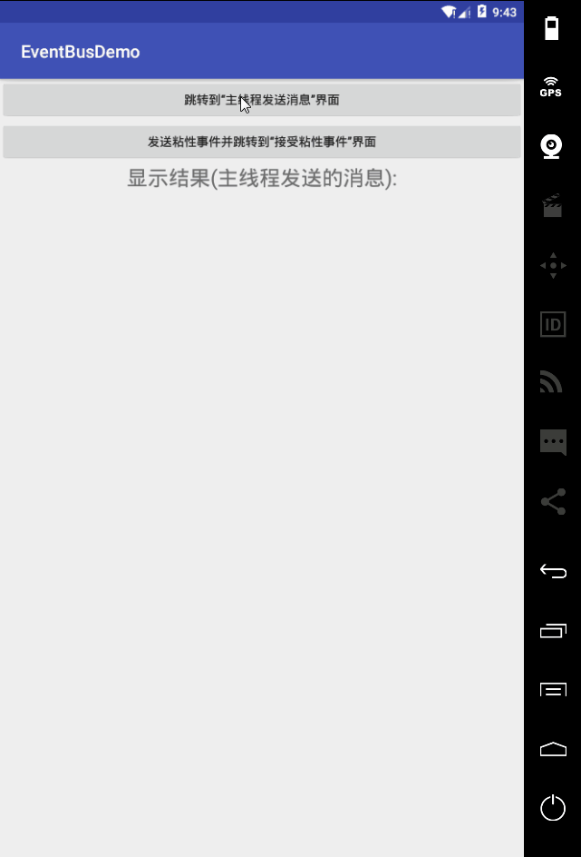

# EventBusDemo
EventBus的用法


###1.简介
EventBus是一个Android端优化的publish/subscribe消息总线，简化了应用程序内各组件间、组件与后台线程间的通信。比如请求网络，等网络返回时通过Handler或Broadcast通知UI，两个Fragment之间需要通过Listener通信，这些需求都可以通过EventBus实现。


###2.下载地址
https://github.com/greenrobot/EventBus

###3.使用步骤
1）添加jar包到libs文件夹下或者在gradle下添加

```
compile 'org.greenrobot:eventbus:3.0.0'
```

2）注册

```
@Override
protected void onCreate(Bundle savedInstanceState) {
    super.onCreate(savedInstanceState);
    setContentView(R.layout.activity_main);

    EventBus.getDefault().register(this);

}
```

3）解注册

```
@Override
protected void onDestroy() {
    super.onDestroy();
    EventBus.getDefault().unregister(this);
}
```

4）构造发送消息类
自定义一个消息类，封装要发送的消息。
```
public class MessageEvent {
    public String name;
    public String password;

    public MessageEvent(String name, String password) {
        this.name = name;
        this.password = password;
    }
}
```

5）发布消息

```
EventBus.getDefault().post(new MessageEvent("dahaige","123456"));
```

6）接收消息
接受的消息有四种方式：

 -  ThreadMode.MAIN 表示这个方法在主线程中执行
 -  ThreadMode.BACKGROUND 表示该方法在后台执行，不能并发处理
 - ThreadMode.ASYNC 也表示在后台执行，可以异步并发处理。
 - ThreadMode.POSTING 表示该方法和消息发送方在同一个线程中执行


```
@Subscribe(threadMode = ThreadMode.MAIN)
public void messageEventBus(MessageEvent event){
        tv_result.setText("name:"+event.name+" passwrod:"+event.password);
}
```


###4.粘性事件
之前说的使用方法, 都是需要先注册(register), 再post,才能接受到事件; 
如果你使用postSticky（粘性）发送事件, 那么可以不需要先注册, 也能接受到事件。
使用步骤：
1）构造发送信息类
同样自定义一个消息类，封装要发送的消息
```
public class StickyEvent {
    public String msg;

    public StickyEvent(String msg) {
        this.msg = msg;
    }
}
```

2）发布消息

```
EventBus.getDefault().postSticky(new StickyEvent("我是粘性事件"));
```

3）接受消息

```
   //注意,和之前的方法一样,只是多了一个 sticky = true 的属性.
    @Subscribe(threadMode = ThreadMode.MAIN, sticky = true)
    public void onEvent(StickyEvent event){
        tv_c_result.setText(event.msg);
    }
```

4）注册

```
EventBus.getDefault().register(CActivity.this);
```

5）解注册

```
EventBus.getDefault().removeAllStickyEvents();
EventBus.getDefault().unregister(CActivity.class);
```

###5.例子

 1. 主线程发送消息
 
 2. 发送粘性事件

MainActivity代码（接受主线程发送过来的消息）

```
package com.gjg.eventbusdemo;

import android.content.Intent;
import android.support.v7.app.AppCompatActivity;
import android.os.Bundle;
import android.view.View;
import android.widget.TextView;

import org.greenrobot.eventbus.EventBus;
import org.greenrobot.eventbus.Subscribe;
import org.greenrobot.eventbus.ThreadMode;

public class MainActivity extends AppCompatActivity {
    private TextView tv_result;

    @Override
    protected void onCreate(Bundle savedInstanceState) {
        super.onCreate(savedInstanceState);
        setContentView(R.layout.activity_main);
        //注册
        EventBus.getDefault().register(this);
        tv_result = (TextView)findViewById(R.id.tv_result);

    }


    //接受主线程发送的消息
    @Subscribe(threadMode = ThreadMode.MAIN)
    public void  receivedMsgFromMain(MessageEvent messageEvent){
        tv_result.setText("name="+messageEvent.name+"---password="+messageEvent.password);

    }

    public void toMainSend(View view){
        Intent intent=new Intent(this,SendActivity.class);
        startActivity(intent);
    }

    public void toStickSend(View view){
        //发送粘性事件
        EventBus.getDefault().postSticky(new StickyEvent("粘性事件发过来的消息！"));
        Intent intent=new Intent(this,SendActivity.class);
        startActivity(intent);
    }

    @Override
    protected void onDestroy() {
        super.onDestroy();
        //解注册
        EventBus.getDefault().unregister(this);
    }
}

```

SendActivity代码 （接受粘性事件的消息）

```
package com.gjg.eventbusdemo;

import android.app.Activity;
import android.os.Bundle;
import android.view.View;
import android.widget.TextView;

import org.greenrobot.eventbus.EventBus;
import org.greenrobot.eventbus.Subscribe;
import org.greenrobot.eventbus.ThreadMode;

/**
 * Created by JunGuang_Gao
 * on 2017/2/22  21:46.
 * 类描述：
 */
public class SendActivity extends Activity {
    private TextView tv_received_stick_result;
    private boolean isClickOne = true;

    @Override
    protected void onCreate(Bundle savedInstanceState) {
        super.onCreate(savedInstanceState);
        setContentView(R.layout.activity_send);

        tv_received_stick_result = (TextView) findViewById(R.id.tv_received_stick_result);


    }

    //主线程发送消息
    public void mainSend(View view) {
        EventBus.getDefault().post(new MessageEvent("gjg", "666"));
        finish();
    }

    //接受粘性事件
    public void stickReceived(View view) {
        if(isClickOne){//防止多次点击出错
            EventBus.getDefault().register(this);
            isClickOne = false;
        }

    }


    //注意,和之前的方法一样,只是多了一个 sticky = true 的属性.
    @Subscribe(threadMode = ThreadMode.MAIN, sticky = true)
    public void receivedStickMsg(StickyEvent event) {
        tv_received_stick_result.setText(event.msg);
    }

    @Override
    protected void onDestroy() {
        super.onDestroy();
        EventBus.getDefault().removeAllStickyEvents();
        EventBus.getDefault().unregister(this);
    }
}

```

MessageEvent代码（用来在主线程发送的消息类）

```
public class MessageEvent {
    public String name;
    public String password;

    public MessageEvent(String name, String password) {
        this.name = name;
        this.password = password;
    }
}
```

StickEvent代码（用来发送粘性事件的消息类）

```
public class StickyEvent {
    public String msg;

    public StickyEvent(String msg) {
        this.msg = msg;
    }
}
```

运行的效果：

